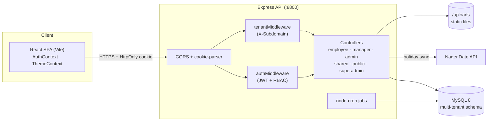

<div align="center">

# 🏢 Human Resource Management System


**A full-stack, multi-tenant Human Resource Management System built with React, Node.js/Express and MySQL.**

It started as a leave tracker and grew into an HR platform covering org structure, attendance, leave, payroll, documents, messaging, recruitment, performance, assets and expenses, all running as a multi-tenant SaaS.

[](https://github.com/Nura-Alam-Naim/Leave-Management-Portal/actions/workflows/ci.yml)


[Features](#-features) •
[Tech Stack](#-tech-stack) •
[Architecture](#-architecture) •
[Getting Started](#-getting-started) •
[API Reference](#-api-reference) •
[Testing](#-testing) •
[Deployment](#-deployment)

</div>

---

## 📖 Table of Contents

- [Overview](#-overview)
- [Features](#-features)
- [User Roles](#-user-roles)
- [Tech Stack](#-tech-stack)
- [Architecture](#-architecture)
- [Project Structure](#-project-structure)
- [Getting Started](#-getting-started)
- [Environment Variables](#-environment-variables)
- [Demo Data & Test Credentials](#-demo-data--test-credentials)
- [Scheduled Jobs](#-scheduled-jobs)
- [API Reference](#-api-reference)
- [Database Schema](#-database-schema)
- [Testing](#-testing)
- [CI/CD](#-cicd)
- [Deployment](#-deployment)
- [Security](#-security)
- [Roadmap](#-roadmap)
- [Contributing](#-contributing)
- [License](#-license)
- [Author](#-author)

---

## 🌟 Overview

The **Leave Management Portal** is an HR platform for small and medium organisations. Each company is an isolated **tenant**, and every record (users, departments, leaves, payslips and so on) is scoped by `company_id`.

On startup the backend creates the database and runs the schema migrations, so a fresh clone needs no manual SQL. To fill every module with realistic test data, run `npm run seed` (see [Demo Data & Test Credentials](#-demo-data--test-credentials)).

---

## ✨ Features

### 🔐 Authentication & Access Control
- **JWT authentication** stored in **HttpOnly cookies** (not readable from JavaScript).
- **Role-based access control (RBAC)** across four roles: Employee, Manager, Admin and Super Admin.
- **Forced password change on first login** (`is_first_login` flag).
- **bcrypt** password hashing.
- **Input validation** with `express-validator`.
- **IDOR protection**: users can only read and change their own data.
- **Startup environment validation** that stops the server with a clear message if required config is missing.

### 🏗️ Organisation & Hierarchy
- Normalised **departments** and **designations**.
- An interactive **org chart** of the company hierarchy.
- **Department views** showing each manager and team.
- **Employee transfers** with a manager → admin approval flow.
- **Member requests**: managers ask HR for new headcount, and admins resolve the requests.
- Admins can change an employee's role, department or designation.

### ⏱️ Time & Attendance
- A **web clock-in widget** with clock-in, clock-out and resume-shift.
- **Personal timesheets** with average daily hours.
- **Company-wide timesheet monitoring** for HR/Admin.

### 🌴 Advanced Leave Management
- Apply for, edit and cancel leave requests.
- **Excludes weekends and public holidays** when counting leave days.
- **Two-step approval**: Manager first, then HR Admin (`pending_manager` → `pending_hr` → `approved` / `rejected`).
- Balance is **deducted automatically on approval** and refunded when a request is cancelled or rejected.
- **Public holiday management**, including a one-click **sync from the [Nager.Date](https://date.nager.at) API**.
- **Automatic monthly accrual** and a **yearly reset** (see [Scheduled Jobs](#-scheduled-jobs)).

### 👤 Employee Profiles & Documents
- Rich employee profile pages.
- **Secure file uploads** (medical certificates, CVs, ID cards) using Multer.
- Profile picture upload.

### 💰 Payroll & Salary
- Payslips generated from base salary, attendance and unpaid leave.
- Admin salary overview and payslip history.
- Employees can view their own payslips under **My Payslips**.

### 💬 Internal Chat & Messaging
- Direct messages between employees, managers and HR.
- Conversation list and contact directory.
- **Read receipts** and **unread message counts**.

### 🧑‍💼 Recruitment & ATS
- A public **careers page** (`/careers`) where candidates can apply.
- Admins create, edit and close job postings.
- Applications move through a **candidate pipeline** of status stages.
- Interview tracking.

### 📈 Performance & KPIs
- Managers set and update **goals** for their team.
- Employees update the progress of their own goals.
- **Appraisals / performance reviews** written by managers.
- **My Performance** and **Team Performance** dashboards.

### 💻 Asset Management
- Track company laptops, monitors, keys and software licences.
- Assign assets to employees. Each employee can see their assigned items under **My Assets**.

### 🧾 Expense Claims
- Employees submit reimbursement claims.
- Managers and admins approve or reject them.

### 📊 Analytics & Audit
- Dashboards with **Recharts** visualisations of leave statuses and trends.
- A **system activity log** that records administrative actions.
- **Server-side pagination** for large lists.

### ☁️ Multi-Tenant SaaS
- **Each company's data is kept separate**, scoped by `company_id`.
- **Self-service company registration** (`/register`).
- **Subdomain-based tenant resolution** for public endpoints such as the careers board (`X-Subdomain` header).
- A **Super Admin console** for registering and listing companies.

### 🎨 UI / UX
- A responsive interface built with React 19 and SCSS modules.
- **Light/dark theme** via `ThemeContext`.
- Toast notifications (`react-hot-toast`) and Lucide icons.
- An app-wide **error boundary**.

---

## 👥 User Roles

| Capability | Employee | Manager | Admin (HR) | Super Admin |
| :--- | :---: | :---: | :---: | :---: |
| Clock in/out, timesheets | ✅ | ✅ | ✅ | — |
| Apply/edit/cancel leave | ✅ | ✅ | ✅ | — |
| Payslips, documents, assets, expenses | ✅ | ✅ | ✅ | — |
| Internal messaging, org chart | ✅ | ✅ | ✅ | — |
| Approve team leave (1st tier) | — | ✅ | ✅ | — |
| Team analytics, goals & appraisals | — | ✅ | ✅ | — |
| Request headcount / transfers | — | ✅ | ✅ | — |
| Final leave approval (2nd tier) | — | — | ✅ | — |
| User provisioning & role changes | — | — | ✅ | — |
| Departments, designations, holidays | — | — | ✅ | — |
| Payroll, ATS, asset management | — | — | ✅ | — |
| Register & manage tenant companies | — | — | — | ✅ |

---

## 🛠️ Tech Stack

| Layer | Technologies |
| :--- | :--- |
| **Frontend** | React 19, Vite 8, React Router 7, Context API, SCSS (Sass), Axios, Recharts, Lucide React, React Hot Toast, React Compiler |
| **Backend** | Node.js 20 (ES Modules), Express 5, mysql2 (promise pool), JSON Web Tokens, bcrypt, cookie-parser, CORS, express-validator, Multer, node-cron, Nodemailer, Axios |
| **Database** | MySQL 8.0 |
| **Testing** | Jest 30, Supertest |
| **DevOps** | Docker, Docker Compose, Nginx (serves the frontend), GitHub Actions CI |
| **Tooling** | ESLint, Nodemon, Concurrently, cross-env |

---

## 🧭 Architecture



---

## 📁 Project Structure

```text
Leave_Management_Portal/
├── .github/workflows/ci.yml      # CI: backend tests + frontend build
├── docker-compose.yml            # MySQL + backend + frontend (Nginx)
├── package.json                  # Root scripts (runs both apps concurrently)
├── docs/                         # Design notes, implementation plans & walkthroughs
│
├── backend/
│   ├── index.js                  # Express app entry, route mounting, CORS
│   ├── database/
│   │   ├── db.js                 # MySQL pool, schema bootstrap & migrations
│   │   └── seed.js               # Demo data seeder (npm run seed / seed:fresh)
│   ├── Dockerfile
│   ├── controllers/
│   │   ├── admin/                # analytics, assets, ats, departments, designations,
│   │   │                         # leaves, payroll, requests, users
│   │   ├── employee/             # documents, leaves, payroll, timesheet
│   │   ├── manager/              # leaves, team
│   │   ├── public/               # careers (job board)
│   │   ├── shared/               # auth, expenses, holidays, messages, performance
│   │   └── superadmin/           # companies (tenants)
│   ├── routes/                   # Mirrors the controllers folder
│   ├── middleware/
│   │   ├── authMiddleware.js     # JWT verification & role guards
│   │   ├── tenantMiddleware.js   # Subdomain → company_id resolution
│   │   └── validators.js         # express-validator rule sets
│   ├── cron/jobs.js              # Scheduled jobs
│   ├── utils/
│   │   ├── envValidator.js       # Fails fast on missing env vars
│   │   └── leaveUtils.js         # Working-day / holiday calculations
│   ├── tests/                    # Jest + Supertest suites
│   └── uploads/                  # User-uploaded files (served statically)
│
└── frontend/
    ├── Dockerfile                # Multi-stage build → Nginx
    └── src/
        ├── App.jsx               # Routing & role-based route guards
        ├── main.jsx
        ├── index.scss            # Global design tokens & styles
        ├── context/              # AuthContext, ThemeContext
        ├── components/           # Navbar, ClockInWidget, LeaveForm, Modal,
        │                         # Pagination, ManagerAnalytics, ActivityLog, ...
        └── pages/                # Dashboards, Payroll, ATS, Assets, Messages,
                                  # OrgChart, Timesheets, Careers, Register, ...
```

---

## 🚀 Getting Started

### Prerequisites

- **Node.js** v20 or newer, and npm
- **MySQL** 8.0 (local or remote), or **Docker** with Docker Compose
- **Git**

### Option 1 — Local Development

**1. Clone the repository**

```bash
git clone https://github.com/Nura-Alam-Naim/Leave-Management-Portal.git
cd Leave-Management-Portal
```

**2. Install dependencies**

```bash
npm install                    # root (concurrently)
npm install --prefix backend
npm install --prefix frontend
```

**3. Configure environment variables**

Create `backend/.env`:

```env
PORT=8800
DB_HOST=localhost
DB_PORT=3306
DB_USER=root
DB_PASSWORD=your_mysql_password
DB_NAME=leave_management_db
JWT_SECRET=replace_with_a_long_random_string
FRONTEND_URL=http://localhost:5173
HOLIDAY_COUNTRY_CODE=BD
```

Create `frontend/.env`:

```env
VITE_API_URL=http://localhost:8800
```

**4. Seed demo data (recommended)**

```bash
npm run seed --prefix backend
```

This fills the database with test data for every module across three tenant companies. See [Demo Data & Test Credentials](#-demo-data--test-credentials).

**5. Start both apps**

```bash
npm run dev
```

| Service | URL |
| :--- | :--- |
| Frontend | http://localhost:5173 |
| Backend API | http://localhost:8800 |

> 💡 You don't need to run any SQL by hand. When the backend starts (or the seeder runs) it creates the database, builds every table and applies the migrations.

You can also start each app on its own:

```bash
npm run backend    # nodemon on backend/index.js
npm run frontend   # Vite dev server
```

### Option 2 — Docker Compose

```bash
docker compose up --build
```

| Service | Container | Port |
| :--- | :--- | :--- |
| MySQL 8 | `leave_portal_db` | `3306` |
| Backend API | `leave_portal_backend` | `8800` |
| Frontend (Nginx) | `leave_portal_frontend` | `80` |

Then open **http://localhost**.

To load demo data into the containerised database:

```bash
docker compose exec backend npm run seed
```

> ⚠️ `docker-compose.yml` ships with fallback credentials for convenience. Before you deploy anywhere real, override `DB_PASSWORD`, `DB_NAME` and `JWT_SECRET` in a root `.env` file.

---

## 🔧 Environment Variables

### Backend (`backend/.env`)

| Variable | Required | Default | Description |
| :--- | :---: | :--- | :--- |
| `DB_HOST` | ✅ | — | MySQL host |
| `DB_USER` | ✅ | — | MySQL user |
| `DB_PASSWORD` | ✅ | — | MySQL password (can be empty locally, but must be defined) |
| `DB_NAME` | ✅ | — | Database name (created automatically if missing) |
| `JWT_SECRET` | ✅ | — | Secret used to sign JWTs |
| `DB_PORT` | ❌ | `3306` | MySQL port |
| `DB_SSL` | ❌ | `false` | Set to `true` for managed databases that require SSL (e.g. Aiven, PlanetScale) |
| `PORT` | ❌ | `3000` | API port (`8800` in Docker) |
| `FRONTEND_URL` | ❌ | — | Extra allowed CORS origin for production (`http://localhost:5173` is always allowed) |
| `HOLIDAY_COUNTRY_CODE` | ❌ | `BD` | ISO country code used when syncing public holidays |
| `NODE_ENV` | ❌ | — | Set to `test` to skip `app.listen` during tests |

### Frontend (`frontend/.env`)

| Variable | Description |
| :--- | :--- |
| `VITE_API_URL` | Base URL of the backend API |

---

## 🔑 Demo Data & Test Credentials

[`backend/database/seed.js`](backend/database/seed.js) fills the database with **deterministic dummy data**, so every screen can be tested by hand without typing anything in first.

```bash
cd backend
npm run seed         # seed once (skips if demo data already exists)
npm run seed:fresh   # wipe previous demo data and re-seed from scratch
```

> 🔐 **Every account uses the password `12345`.** Seeded accounts skip the forced first-login password change, so you go straight to the dashboard.

### What gets seeded

| Company (subdomain) | Users | Departments | Leaves | Attendance | Payslips | Messages | Jobs / Candidates | Goals | Assets | Expenses |
| :--- | :---: | :---: | :---: | :---: | :---: | :---: | :---: | :---: | :---: | :---: |
| Default Company (`default`) | 41 | 7 | ~120 | ~800 | 123 | ~120 | 11 / ~37 | ~98 | ~99 | ~77 |
| Acme Corporation (`acme`) | 16 | 3 | ~50 | ~320 | 48 | ~47 | 6 / ~21 | ~36 | ~40 | ~27 |
| Globex Industries (`globex`) | 11 | 2 | ~30 | ~210 | 33 | ~39 | 3 / ~8 | ~26 | ~33 | ~18 |

The seed also includes:

- **Attendance** for the last 30 working days, including late arrivals, half-days and absences. **Today is left empty** so you can test the clock-in widget.
- **Leave requests in every status** (`pending`, `approved`, `rejected`, `cancelled`), spread across past and upcoming dates.
- **Payslips** for the last 3 months. The current month is left empty so you can test *Generate Payroll*.
- **Chat conversations** with unread messages, plus tickets sent to the HR/Admin inbox.
- **Job postings** (open, closed and draft), candidates at every pipeline stage, and scheduled/completed interviews.
- **Goals, appraisals, assets, expense claims, transfer and headcount requests, activity logs and public holidays.**

### 🛰️ Platform

| Role | Name | Email |
| :--- | :--- | :--- |
| Super Admin | Super Admin | `superadmin@hrms.dev` |

### 🏢 Default Company — `default`

| Role | Name | Email | Department |
| :--- | :--- | :--- | :--- |
| Admin (HR) | Charlie Admin | `charlie@company.com` | Human Resources |
| Manager | Alice Manager | `alice@company.com` | Engineering |
| Manager | Diana Smith | `diana@company.com` | Human Resources |
| Manager | Fiona Davis | `fiona@company.com` | Sales |
| Manager | Marcus Reed | `marcus@company.com` | Marketing |
| Manager | Priya Sharma | `priya@company.com` | Finance |
| Manager | Sofia Martinez | `sofia@company.com` | Customer Support |
| Manager | Liam Chen | `liam@company.com` | Product & Design |
| Employee | Bob Employee | `bob@company.com` | Engineering |
| Employee | Ethan Brown | `ethan@company.com` | Engineering |
| Employee | Hannah Lee | `hannah@company.com` | Engineering |
| Employee | George Wilson | `george@company.com` | Sales |

### 🏭 Acme Corporation — `acme`

| Role | Name | Email | Department |
| :--- | :--- | :--- | :--- |
| Admin (HR) | Olivia Carter | `admin@acme.com` | Human Resources |
| Manager | Nathan Brooks | `nathan@acme.com` | Engineering |
| Manager | Grace Kim | `grace@acme.com` | Sales |
| Manager | Daniel Ortiz | `daniel@acme.com` | Human Resources |
| Employee | Emily Stone | `emily@acme.com` | Engineering |

### 🌐 Globex Industries — `globex`

| Role | Name | Email | Department |
| :--- | :--- | :--- | :--- |
| Admin (HR) | Victor Hale | `admin@globex.com` | Operations |
| Manager | Isabel Novak | `isabel@globex.com` | Operations |
| Manager | Ryan Patel | `ryan@globex.com` | Finance |
| Employee | Henry Ford | `henry@globex.com` | Operations |

> ℹ️ About 50 more employees are generated with the pattern `firstname.lastname@<company-domain>` (e.g. `@company.com`, `@acme.com`) and use the same password. You can browse them all in **All Employees** while logged in as an Admin. The seeder also prints a full summary when it finishes.

### 🧪 Suggested test flows

| Scenario | Steps |
| :--- | :--- |
| **Two-step leave approval** | Log in as `bob@company.com` → apply for leave → log in as `alice@company.com` (manager) to approve → log in as `charlie@company.com` (admin) for final approval |
| **Tenant isolation** | Log in as `charlie@company.com`, then as `admin@acme.com`. Each admin sees only their own company's employees, leaves and assets |
| **Messaging** | Log in as any manager. Several conversations already have unread messages |
| **Recruitment** | Open `/careers` to apply as a candidate, then manage the pipeline under **Recruitment** as an admin |
| **Payroll** | As an admin, generate payslips for the current month and compare them with earlier months |
| **Super Admin** | Log in as `superadmin@hrms.dev` to list tenants and register a new company |

> ⚠️ The seeder is for **development and demos only**. Don't run it against a production database.

---

## ⏰ Scheduled Jobs

Defined in [`backend/cron/jobs.js`](backend/cron/jobs.js) and powered by `node-cron`:

| Job | Schedule | Cron | What it does |
| :--- | :--- | :--- | :--- |
| Auto-reject expired requests | Daily at 00:00 | `0 0 * * *` | Rejects pending requests whose end date has passed |
| Monthly leave accrual | 1st of every month | `0 0 1 * *` | Adds **1.5 days** to every employee's balance |
| Yearly balance reset | 1 January | `0 0 1 1 *` | Resets every leave balance to **20 days** |

---

## 📡 API Reference

All endpoints are prefixed with `/api`. Protected routes need a valid JWT cookie, and most of them also check the user's role.

<details>
<summary><b>🔐 Auth</b> — <code>/api/auth</code></summary>

| Method | Endpoint | Description |
| :--- | :--- | :--- |
| POST | `/login` | Log in and set the HttpOnly JWT cookie |
| POST | `/register` | Register a new company and its admin (tenant onboarding) |
| POST | `/logout` | Clear the session cookie |
| PUT | `/change-password` | Change password (also completes the first-login step) |
| GET | `/me` | Get the current user |

</details>

<details>
<summary><b>👨‍💻 Employee</b></summary>

| Method | Endpoint | Description |
| :--- | :--- | :--- |
| GET | `/user/leaves/my-requests` | My leave history |
| POST | `/user/leaves/apply` | Apply for leave |
| PUT | `/user/leaves/edit/:request_id` | Edit a pending request |
| PUT | `/user/leaves/cancel/:request_id` | Cancel a request |
| GET | `/user/leaves/profile` | Profile & leave balance |
| POST | `/attendance/clock-in` | Clock in |
| POST | `/attendance/clock-out` | Clock out |
| POST | `/attendance/resume-shift` | Resume a shift |
| GET | `/attendance/status` | Current clock status |
| GET | `/attendance/my-records` | My timesheet records |
| GET | `/attendance/all` | Company timesheets (Admin) |
| POST | `/documents/upload` | Upload a document |
| GET | `/documents/my-documents` | List my documents |
| DELETE | `/documents/:id` | Delete a document |
| POST | `/documents/profile-picture` | Upload a profile picture |
| GET | `/payroll/my-payslips` | My payslips |

</details>

<details>
<summary><b>🧑‍🤝‍🧑 Manager</b></summary>

| Method | Endpoint | Description |
| :--- | :--- | :--- |
| GET | `/manager/leaves/all-requests` | Team leave requests |
| PUT | `/manager/leaves/update-status/:request_id` | First-tier approval or rejection |
| GET | `/manager/team/analytics` | Team analytics |
| GET | `/manager/team/users` | Team members |
| GET | `/manager/team/users/:user_id` | Team member details |
| PUT | `/manager/team/users/:user_id/designation` | Update a member's designation |
| GET / POST | `/manager/team/designations` | List or create designations |
| POST | `/manager/team/request-member` | Request new headcount |
| GET | `/manager/team/my-requests` | My headcount requests |
| POST | `/manager/team/transfer-request` | Request an employee transfer |

</details>

<details>
<summary><b>🛡️ Admin (HR)</b></summary>

| Method | Endpoint | Description |
| :--- | :--- | :--- |
| GET | `/admin/leaves/all-requests` | All company leave requests |
| PUT | `/admin/leaves/update-status/:request_id` | Final approval or rejection |
| GET | `/admin/leaves/users` | Paginated user directory |
| GET | `/admin/leaves/users/:user_id` | User details & history |
| POST | `/admin/leaves/users/create-user` | Create a user account |
| PUT | `/admin/leaves/users/:user_id/role` | Change role |
| PUT | `/admin/leaves/users/:user_id/department` | Change department |
| PUT | `/admin/leaves/users/:user_id/designation` | Change designation |
| GET | `/admin/leaves/analytics` | Company analytics |
| GET | `/admin/leaves/analytics/logs` | Activity / audit log |
| GET / POST | `/departments` | List or create departments |
| GET / PUT | `/departments/:id` | View or update a department |
| PUT | `/departments/transfer-requests/:id/status` | Resolve a transfer request |
| GET / POST | `/designations` | List or create designations |
| GET | `/designations/department/:departmentId` | Designations in a department |
| GET | `/requests/member` | Headcount requests |
| GET / PUT | `/requests/member/:id` | View or resolve a headcount request |
| GET | `/admin/payroll/salaries` | Salary overview |
| POST | `/admin/payroll/generate` | Generate payslips |
| GET | `/admin/payroll/payslips` | All payslips |
| GET / POST | `/admin/ats/jobs` | List or create job postings |
| PUT / DELETE | `/admin/ats/jobs/:id` | Update or delete a posting |
| GET | `/admin/ats/applications` | Candidate applications |
| PUT | `/admin/ats/applications/:id/status` | Move a candidate to another pipeline stage |
| GET / POST | `/assets` | List or create assets |
| PUT / DELETE | `/assets/:id` | Update or delete an asset |
| GET | `/assets/my-assets` | Assets assigned to me (any role) |

</details>

<details>
<summary><b>🤝 Shared</b></summary>

| Method | Endpoint | Description |
| :--- | :--- | :--- |
| GET / POST | `/holidays` | List or add public holidays |
| POST | `/holidays/sync` | Import holidays from Nager.Date |
| DELETE | `/holidays/:id` | Remove a holiday |
| GET | `/messages/conversations` | Conversation list |
| GET | `/messages/contacts` | Contact directory |
| GET | `/messages/unread-count` | Unread message count |
| GET | `/messages/:otherId` | Message thread |
| POST | `/messages` | Send a message |
| PUT | `/messages/:otherId/read` | Mark a thread as read |
| GET | `/performance/my-performance` | My goals & appraisals |
| PUT | `/performance/my-goals/:id/status` | Update my goal's progress |
| POST | `/performance/goals` | Create a goal (Manager) |
| PUT | `/performance/goals/:id` | Update a goal (Manager) |
| POST | `/performance/appraisals` | Submit an appraisal (Manager) |
| GET | `/performance/team/:employee_id` | An employee's performance (Manager) |
| GET | `/expenses/my-claims` | My expense claims |
| POST | `/expenses/submit` | Submit a claim |
| GET | `/expenses/manage` | Claims awaiting review |
| PUT | `/expenses/:id/status` | Approve or reject a claim |

</details>

<details>
<summary><b>🌐 Public & Super Admin</b></summary>

| Method | Endpoint | Description |
| :--- | :--- | :--- |
| GET | `/careers/jobs` | Open positions (requires `X-Subdomain` header) |
| POST | `/careers/apply` | Submit an application (requires `X-Subdomain` header) |
| POST | `/superadmin/register-company` | Register a new tenant |
| GET | `/superadmin/companies` | List all tenants |

</details>

---

## 🗄️ Database Schema

The backend creates and migrates all tables on startup ([`backend/database/db.js`](backend/database/db.js)).

| Domain | Tables |
| :--- | :--- |
| **Tenancy** | `companies` |
| **Identity & Org** | `users`, `departments`, `designations`, `transfer_requests`, `member_requests` |
| **Leave** | `leave_types`, `leave_requests`, `public_holidays` |
| **Attendance** | `attendance` |
| **Payroll** | `payslips` |
| **Documents** | `documents` |
| **Messaging** | `internal_messages` |
| **Recruitment** | `job_postings`, `job_applications`, `interviews` |
| **Performance** | `performance_goals`, `appraisals` |
| **Operations** | `assets`, `expense_claims` |
| **Audit** | `activity_logs` |

---

## 🧪 Testing

The backend has a **Jest + Supertest** integration suite in [`backend/tests`](backend/tests). It runs against a real MySQL instance.

```bash
cd backend
npm test
```

| Suite | Coverage |
| :--- | :--- |
| `auth.test.js` | Login, logout, first-login, password change |
| `leave.test.js` / `leave_logic.test.js` | Leave lifecycle & working-day calculations |
| `attendance.test.js` | Clock-in/out flows |
| `departments.test.js` / `requests.test.js` | Org structure, transfers & headcount requests |
| `hrms.test.js` | Documents, payroll & HR flows |
| `messages.test.js` | Internal messaging |
| `ats.test.js` | Job postings & applications |
| `performance.test.js` | Goals & appraisals |
| `assets.test.js` | Asset management |
| `expenses.test.js` | Expense claims |
| `superadmin.test.js` | Tenant registration & isolation |

Lint the frontend:

```bash
cd frontend
npm run lint
```

---

## 🔄 CI/CD

[GitHub Actions](.github/workflows/ci.yml) runs on every push and pull request to `main` / `master`:

1. **Run Backend Tests**: starts a MySQL 8 service container, installs dependencies and runs Jest.
2. **Build Frontend**: runs only if the tests pass, and checks that the Vite production build compiles.

---

## ☁️ Deployment

The backend and frontend deploy separately:

| Component | Suggested platforms | Notes |
| :--- | :--- | :--- |
| **Database** | Aiven, Railway, PlanetScale, AWS RDS | Set `DB_SSL=true` if the provider needs it |
| **Backend** | Render, Railway, Fly.io, any VPS | `npm start`. Set every required env var and set `FRONTEND_URL` to the deployed frontend origin |
| **Frontend** | Vercel, Netlify, or Nginx (Docker) | `npm run build`. Set `VITE_API_URL` to the deployed API |

> 🔒 The backend sets `trust proxy` so secure cross-site cookies work behind load balancers (Render, Heroku and similar). Serve both apps over **HTTPS** in production.

---

## 🛡️ Security

- HttpOnly, `Secure`, `SameSite` JWT cookies: the token is never exposed to client-side JavaScript.
- Passwords hashed with **bcrypt**.
- Role guards on every protected route, and tenant scoping (`company_id`) on every query.
- Request validation and sanitisation with **express-validator**.
- A CORS allow-list limited to known frontend origins.
- The server stops at startup if critical environment variables are missing.
- Users can only access their own records (IDOR protection).

> ⚠️ Never commit `.env` files. The repository's `.gitignore` already excludes them.

---

## 🗺️ Roadmap

- [x] Phase 1: Core organisation & hierarchy
- [x] Phase 2: Time & attendance
- [x] Phase 3: Advanced leave management
- [x] Phase 4: System reliability & seeding
- [x] Phase 5: Employee profiles & document management
- [x] Phase 6: Payroll & salary calculations
- [x] Phase 7: Internal chat & messaging
- [x] Phase 8: Recruitment & ATS
- [x] Phase 9: Performance reviews & KPIs
- [x] Phase 10: Asset management
- [x] Phase 11: Expense claims
- [x] Phase 12: Multi-tenant SaaS transformation
- [ ] Subscription billing (Stripe) for tenants
- [ ] Real-time messaging over WebSockets
- [ ] Email notifications for approvals (Nodemailer)
- [ ] Exporting payslips and reports to PDF/CSV

---

## 🤝 Contributing

Contributions are welcome.

1. Fork the repository.
2. Create a feature branch: `git checkout -b feature/amazing-feature`
3. Commit your changes: `git commit -m "feat: add amazing feature"`
4. Push the branch: `git push origin feature/amazing-feature`
5. Open a Pull Request.

Make sure `npm test` (backend) and `npm run lint` (frontend) pass before you submit.

---

## 📄 License

This project is distributed under the **ISC License**.

---

## 👨‍💻 Author

**M. Nura Alam Naim**

- GitHub: [@Nura-Alam-Naim](https://github.com/Nura-Alam-Naim)

<div align="center">

If you find this project useful, consider giving it a ⭐

</div>
